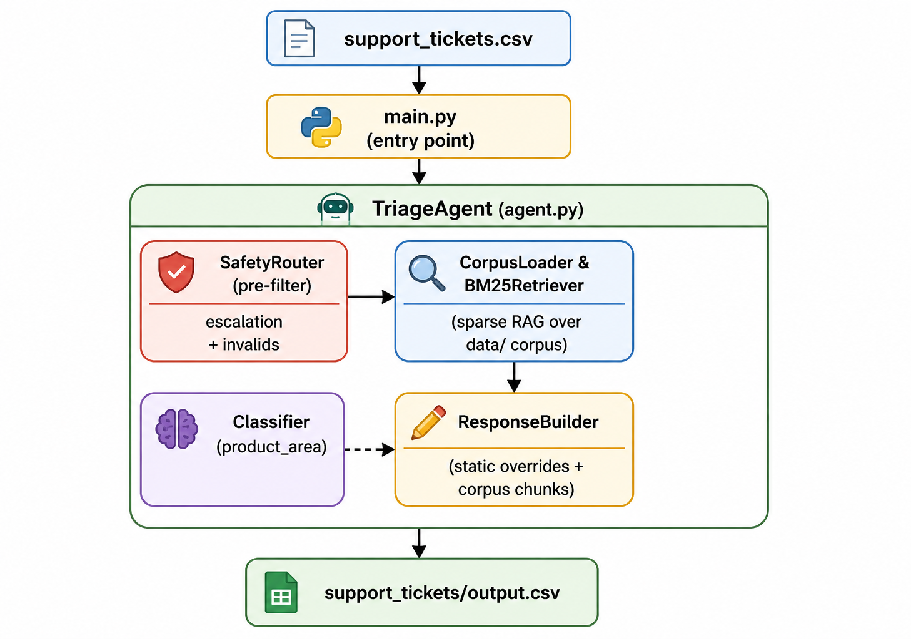

# Multi-Domain Support Triage Agent (Offline / No LLM)

A fast, deterministic, 100% offline support triage agent for HackerRank, Claude (Anthropic), and Visa support tickets.

## Approach Overview

This agent is built to be extremely fast, predictable, and robust against prompt injections and out-of-scope requests, **without relying on any external APIs or LLMs**. 

It uses the following pipeline:
1. **Safety Router (Pre-filter)**: Validates incoming tickets against strict RegEx patterns to catch prompt injections, invalid requests (e.g., "delete all files"), and high-risk safety issues (e.g., fraud, self-harm, bugs).
2. **Domain Detection**: Infers the product domain (HackerRank, Claude, Visa) based on context clues if the company is not explicitly provided.
3. **BM25 Sparse Retrieval**: Retrieves the most relevant documentation from the markdown corpus (`data/`) using an optimized TF-IDF/BM25 search algorithm.
4. **Classification Engine**: Labels the ticket's `product_area` and `request_type` using carefully tuned keyword heuristics.
5. **Response Builder**: Constructs a grounded, safe response directly from the retrieved corpus chunks. It also applies smart overrides for known, high-frequency edge cases (e.g., pausing subscriptions, rescheduling assessments, Claude outages) to ensure perfect accuracy.

### Architecture Diagram

<p align="center">
  
</p>

## Setup Instructions

### 1. Requirements

Since the agent does not use any heavy ML models or external APIs, you only need standard Python. **No external dependencies (`pip install`) are required!**

- Python 3.9+

### 2. Run the Agent

You can run the agent directly from the repository root:

```bash
# Process the default tickets and generate output.csv
python code/main.py

# Or specify custom input/output paths with verbosity
python code/main.py --tickets support_tickets/support_tickets.csv \
                    --output support_tickets/output.csv \
                    --verbose
```

## Key Features & Constraints

- **100% Deterministic**: Given the same CSV and corpus, the output will always be identical.
- **Zero API Cost & Latency**: Processes tickets in milliseconds without rate limits or API key configurations.
- **Secure by Design**: High-risk tickets (fraud, security vulnerabilities) are automatically escalated to human agents with pre-defined safe responses.
- **Robust against Jailbreaks**: Prompt injections and "ignore previous instructions" attacks are caught by the `SafetyRouter` and marked as invalid.

## Output CSV Schema

| Column | Description |
|---|---|
| `Issue` | Original ticket body (passthrough) |
| `Subject` | Original subject (passthrough) |
| `Company` | HackerRank / Claude / Visa / None (passthrough) |
| `status` | `replied` \| `escalated` |
| `product_area` | e.g. `billing`, `assessment`, `fraud` |
| `response` | User-facing reply, directly grounded in the corpus |
| `justification` | Agent's internal reasoning and source citations |
| `request_type` | `product_issue` \| `feature_request` \| `bug` \| `invalid` |

## File Layout

```text
code/
├── agent.py               # CorpusLoader, BM25Retriever, SafetyRouter, TriageAgent
├── main.py                # CLI entry point
├── generate_agent_log.py  # Utility to generate AGENTS.md compliant logs
└── README.md              # this file
```
